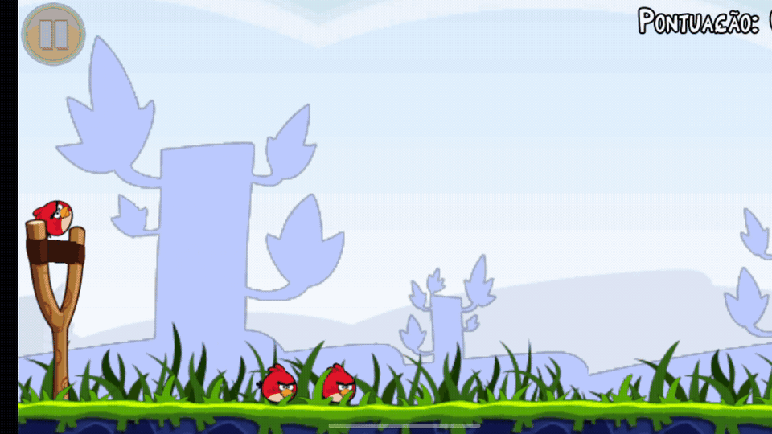
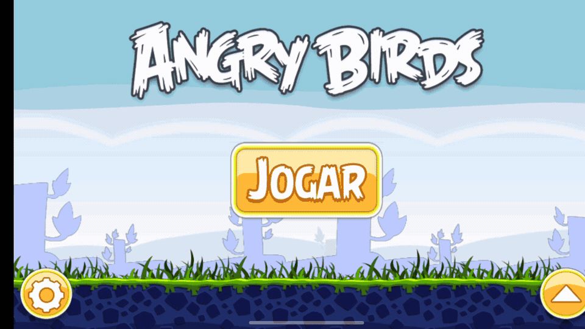

# Angry Birds ARM64

A source reconstruction of **Angry Birds 1.4.2 for Android**, targeting modern
**64-bit ARM (AArch64 / arm64-v8a)** devices.

The original Android release shipped with a 32-bit ARMv7 native runtime.
Rather than porting an available Rovio source tree, this project reconstructs
the native behavior needed by the shipped game and rebuilds that runtime for
AArch64.

The result is a native ARM64 build of the classic Android game: its original
Lua logic and locally supplied game data run on a reconstructed modern Android
runtime instead of the original ARMv7 binary.

> This is an independent preservation and compatibility project. It is not
> affiliated with, sponsored by, or endorsed by Rovio Entertainment.

## Why this project is unusual

This is not a simple rebuild of an existing Android source port.

The original game-side native runtime was shipped as an **ARMv7 binary**.
Reconstruction work therefore involved analyzing the behavior and interfaces
of that runtime, the game's Lua code and data contracts, and then reproducing
the native services required by the game on **AArch64**.

In particular:

- the final runtime is compiled as native `arm64-v8a` code;
- it does not require the original ARMv7 native library at runtime;
- the public build does not link against or redistribute the historical
  KA3D source tree;
- required KA3D-era compatibility behavior is implemented separately in the
  reconstructed runtime;
- original proprietary game assets remain outside this repository and are
  supplied locally by the builder;
- rendering, physics bridges, input, audio, persistence, progression, menus,
  Android lifecycle behavior, and other native-facing systems were
  reconstructed around the original game's existing Lua logic.

The goal is behavioral compatibility with the classic release, not a redesign
or a modern remake.

## What this repository contains

The repository contains the reconstructed native runtime, Android build and
packaging tooling, compatibility code, vendored build dependencies, research
material, and the historical development record.

It does **not** intentionally distribute:

- original Angry Birds game assets;
- the original Angry Birds APK;
- personal save data;
- signing keys or keystores.

A builder must provide their own local copy of the original game data when
staging assets or producing an APK.

## Current status

The active runtime is the final Stage24 reconstruction lineage.

The current build:

- targets `arm64-v8a`;
- produces an AArch64 native library;
- uses Lua 5.1.5 for the original game-side Lua logic;
- uses a historical Box2D 2.1.2 baseline with compatibility changes;
- reconstructs rendering, input, physics bridges, audio, persistence,
  progression, menus, Android lifecycle behavior, and related native services;
- builds through CMake and Ninja with the Android NDK;
- can stage locally supplied original assets and assemble a signed APK.

Historical Stage0-Stage23 sources and experiments remain under `recon/history/`
and `docs/history/`, but they are not part of the current native build target.

The reconstruction reached a release-candidate level of integration across the
main campaign and supporting game systems. Some edge-case fidelity differences
may still exist, especially where exact historical numerical or platform
behavior is difficult to reproduce on modern ARM64 hardware.

## Build requirements

Typical requirements are:

- Python 3;
- CMake;
- Ninja;
- Android SDK;
- Android NDK `30.0.15729638`;
- a local copy of the original Angry Birds 1.4.2 game data for asset staging.

The build orchestrator discovers the Android toolchain from explicit settings,
environment variables, and standard installation locations.

## Build

First check the host environment:

    python build.py doctor

Build only the ARM64 native runtime:

    python build.py native

Force a clean native rebuild:

    python build.py native --clean

Stage original game assets from the builder's local copy:

    python build.py stage

Build the native runtime, stage assets, package, sign, and verify an APK:

    python build.py apk

On Windows, `build.ps1` is provided as a small wrapper. `build.sh` is available
for POSIX-style environments.

### Original game data

The asset pipeline can use the `ANGRY_BIRDS_ORIGINAL_ROOT` environment variable
to locate a local extracted original-game tree.

The original data remains outside the public source tree.

## Repository layout

- `stage24_live_surface.cpp` - current reconstructed ARM64 runtime.
- `CMakeLists.txt` - current native build definition.
- `build.py` - canonical build, staging, packaging, and verification entrypoint.
- `stage24-android/` - Android manifests and package-side source material.
- `vendor/` - required Lua and Box2D source baselines and their notices.
- `tools/` - build helpers, compatibility patches, audits, and developer tools.
- `recon/` - reconstruction artifacts and historical native experiments.
- `docs/history/` - detailed development chronology.
- `docs/research/` - reverse-engineering and compatibility research.
- `docs/release/` - release and security documentation.

The enormous Stage24 development chronology is deliberately kept out of this
README. It is preserved under `docs/history/`.

## Design approach

The project aims to reconstruct behavior rather than redesign the game.

Where possible, compatibility decisions are based on observable behavior,
original ARMv7 runtime analysis, game-side Lua behavior, controlled comparison,
and repeatable audit tooling.

### AI-assisted development

Development was **heavily AI-assisted**, primarily using ChatGPT for
reverse-engineering analysis, code reconstruction, debugging, test and audit
tooling, and documentation, under maintainer direction and hands-on validation
on real hardware.

AI-generated or AI-suggested changes were treated as engineering hypotheses
rather than authoritative output. Relevant changes were compiled, inspected,
compared against observed behavior of the historical runtime, exercised through
repeatable audits or regression checks where practical, and validated on target
Android hardware.

Project leadership, technical direction, acceptance decisions, device testing,
release decisions, and final validation remained with the maintainer.

See `CREDITS.md` for the full development attribution.

The current public runtime does not link against or redistribute the historical
KA3D source tree. See `CREDITS.md` and `THIRD_PARTY_NOTICES.md` for provenance
details.

## Known limitations

This is a reconstruction, not the original Rovio source code.

Current limitations and caveats include:

- a builder must provide their own compatible original Angry Birds 1.4.2 game
  data;
- this repository intentionally does not ship a ready-to-play APK containing
  Rovio's proprietary assets;
- exact floating-point, physics, rendering, or platform behavior can still
  differ in edge cases between the historical ARMv7 runtime and modern ARM64;
- the build and packaging path has been validated on Windows and end-to-end
  from a clean public clone on Ubuntu 24.04 x86_64, including native AArch64
  compilation, asset staging, APK packaging/signing/audit, and installation on
  modern ARM64 Android hardware;
- historical Stage0-Stage23 material is preserved for research and provenance
  but is not part of the active production build.

Known fidelity work is tracked in `ROADMAP.md`.

## Licensing and third-party software

This repository does not currently claim one uniform open-source license over
every file and component.

See:

- `LICENSE.md` for the repository-wide licensing status;
- `THIRD_PARTY_NOTICES.md` for third-party software;
- `CREDITS.md` for project provenance and attribution.

Vendored Lua and Box2D retain their respective upstream copyright and license
notices.

## Credits

Project direction, reconstruction, testing, engineering assistance, and
third-party attribution are documented in `CREDITS.md`.

The original Angry Birds game, assets, characters, names, and trademarks belong
to their respective rights holders.
